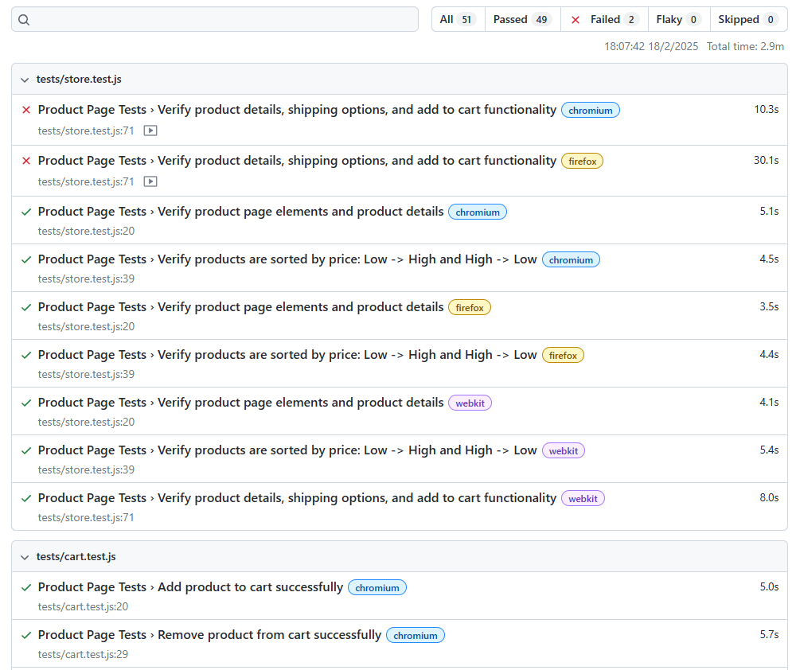

# E-Commerce Automation with Playwright

📌 Features

✅ End-to-end tests for critical user flows (login, checkout, cart, etc.).  
✅ Cross-browser testing (Chromium, Firefox, WebKit, Mobile Viewport).  
✅ Headless & UI mode execution.  
✅ Parallel test execution.  
✅ CI/CD integration.

📝 Registration Notice

If you haven't registered an account for testing yet, please sign up at [MedusaJS Demo Site](https://demo.medusajs.com) to start testing.

🚀 Installation

<pre>
git clone https://github.com/Xiaodie304/playwright-e-commerce.git
cd playwright-e-commerce 
npm install
npx playwright install</pre>

⚙️ Configuration

- Modify test settings in playwright.config.js  
Example: To reduce the number of workers if your machine is not very powerful, you can modify the workers setting in playwright.config.js like this:
<pre>// playwright.config.js
module.exports = {
// Other configurations...
// Set the number of workers to 1 for machines with low resources
workers: 1,
// Other configurations...
};</pre>

- Environment variables can be set in .env
<pre># Example environment variables

# Test account credentials

TEST_USERNAME=demo_user # Test login username  
TEST_PASSWORD=demo_pass # Test login password

# Target website URL

BASE_URL=https://demo.medusajs.com # Website under test

# Email configuration for notifications

EMAIL_USER=testemail@gmail.com # Sender email account  
EMAIL_PASS=abcd1234xyz # Email app password  
MAIL_TO=receiver@example.com # Recipient email address</pre>

Note: Don't commit .env to Git for security reasons! Add it to .gitignore.

🔥 Running Tests

Run all tests:<pre>npm run test</pre>

Run a specific test:<pre>npm run test tests/login.test.js</pre>

📊 Playwright Report

<pre>npx playwright show-report</pre>

After running tests, you can view the Playwright report:

🛠 Dependencies

- Node.js 22+.
- Playwright (@playwright/test).
- dotenv (if needed for env configs).

📌 CI/CD

- GitHub Actions / Jenkins integration (if applicable).

📂 Project Structure

<pre>
PLAYWRIGHT-E-COMMERCE/
├── .github/workflows/   # CI/CD configurations
├── locators/            # Page element locators
├── node_modules/        # Installed dependencies
├── pages/               # Page Object Model (POM) classes
├── playwright-report/   # Playwright test report (generated)
├── sendmail/            # Email notifications
├── test-data/           # Test data files
├── test-results/        # Test execution results
├── tests/               # Automated test scripts
├── utils/               # Helper functions
├── .dockerignore        # Ignore unnecessary files in Docker
├── .env                 # Environment variables (DO NOT commit this)
├── .gitignore           # Ignore unnecessary files in Git (ensure .env, node_modules,... is ignored)
├── Dockerfile           # Docker setup
├── Jenkinsfile          # Jenkins pipeline configuration
├── LICENSE.md           # License information
├── README.md            # Project documentation
├── package.json         # Node.js dependencies and scripts
├── package-lock.json    # Locked dependency versions
├── playwright.config.js # Playwright test configuration
├── state.json           # Playwright saved state (if used)
</pre>

🐳 Docker Setup

1️⃣ Build the Docker image

<pre>docker build -t playwright-ecommerce .</pre>

2️⃣ Run tests inside the container

<pre>docker run --rm -it playwright-ecommerce</pre>
